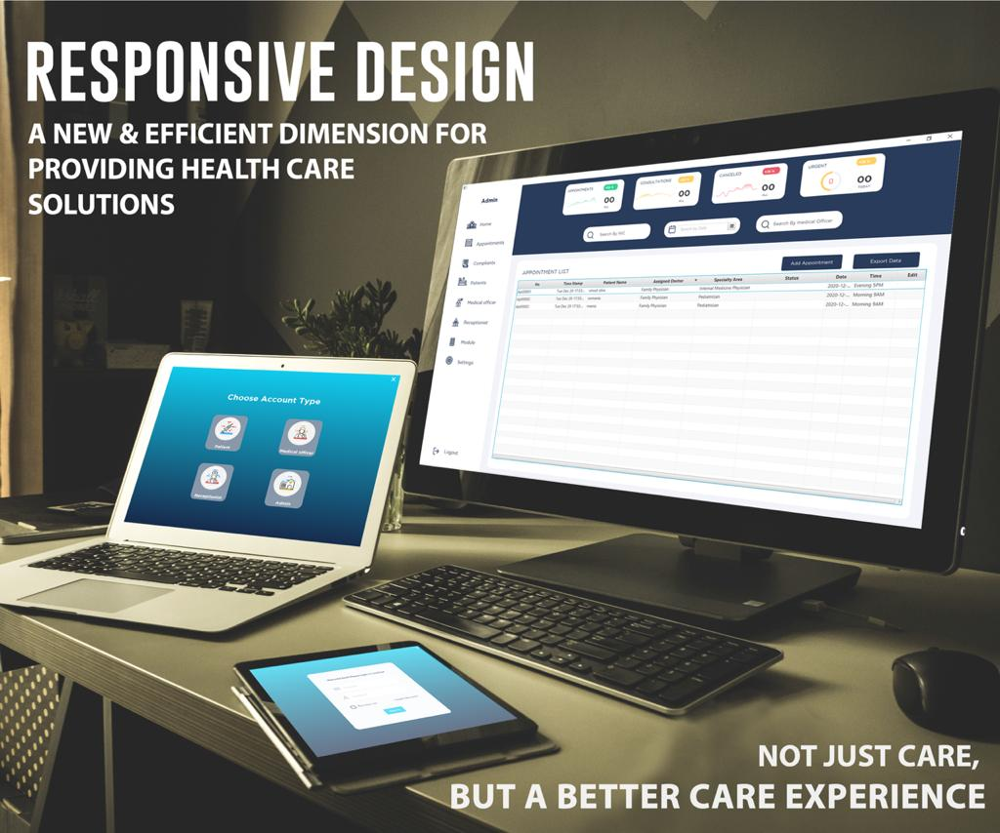
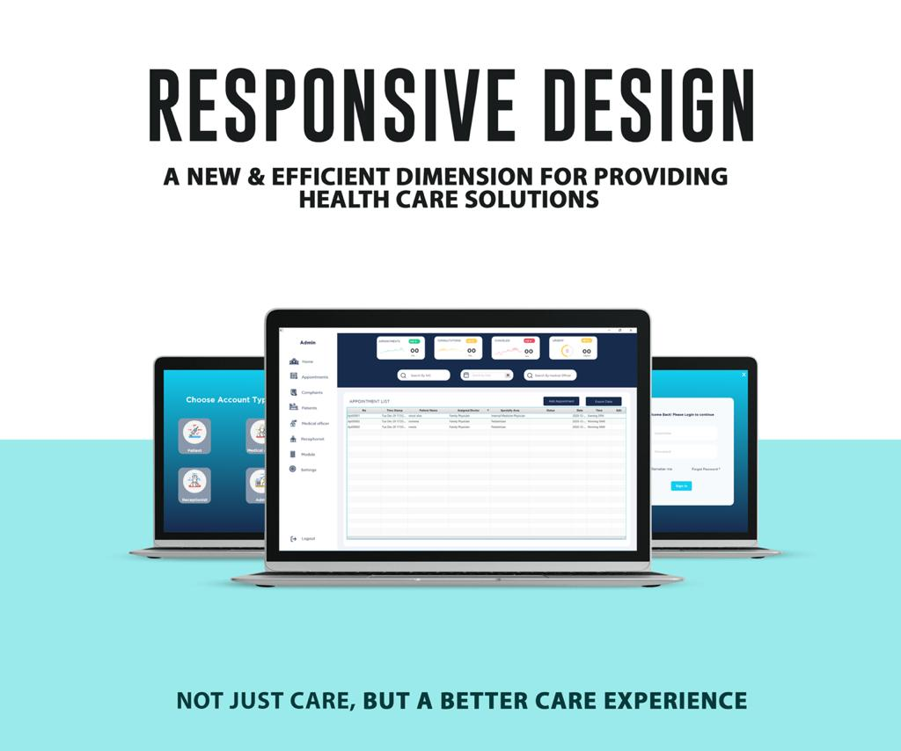

#  :hospital: Hospital-OPD-Management-System

## Introduction 🎉
OPD (Out-Patient Department) is responsible for managing out-patients who just come for a doctor for their issue/ disease checkup and managing front desk operations such as managing a visitor book, call log, postal records, and complaints.

This system will be mainly used by:

<ul><li>Receptionist</li><li>Patient</li><li>Medical Officer</li><li>Admin</li></ul>

  
 

 

The Hospital-OPD Management System we developed is a desktop application system that was built according to the MVC architecture, using the technologies which are Java, JavaFX, itextpdf and jfoenix libraries, singleton pattern, and File Handling. By analyzing the project requirements, we categorized our system into seven main functions which also include their subfunctions as well. Therefore, the seven main functions are Visitor management, Postal management, Complain management, Appointment management, Reference management, User management, and Report management. Since we have analyzed and recognized well our project’s main requirements, and with our group members’ efforts, we were able to build a successful Hospital management System with additional features that we were able to do project satisfaction level.

## Tech-Stack

### Languages 
 
 

### Frameworks and Libs
 
 
 

### Tools and Technologies
 
 
 

If you liked the repo then please support it by giving it a star ⭐!

## License

